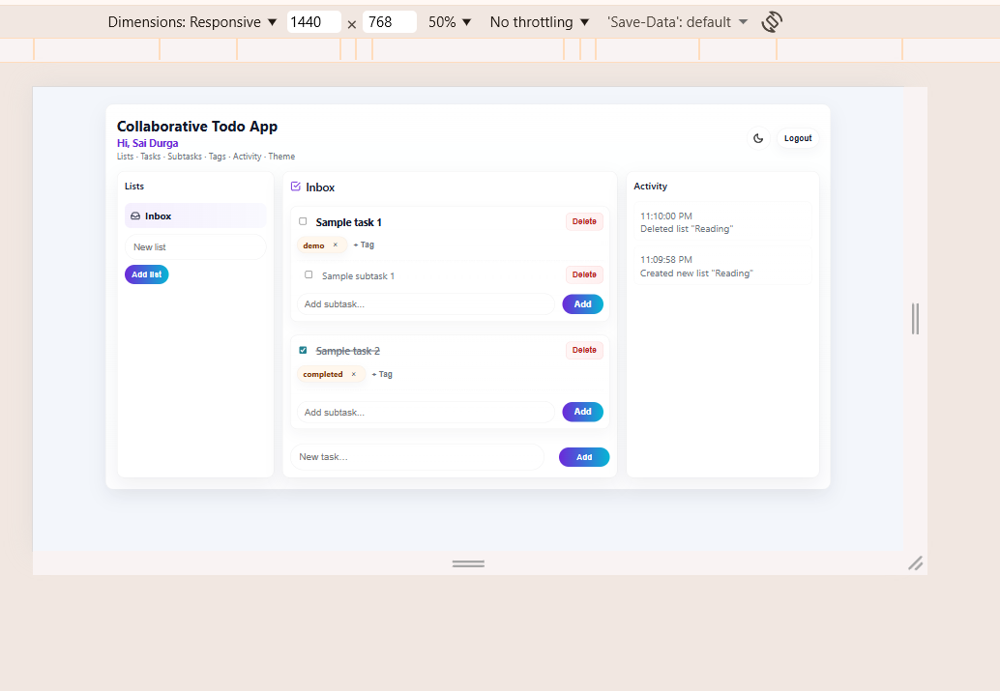
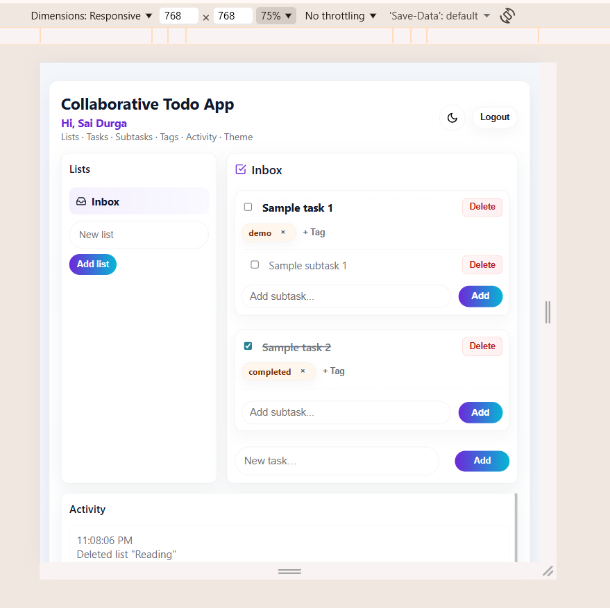
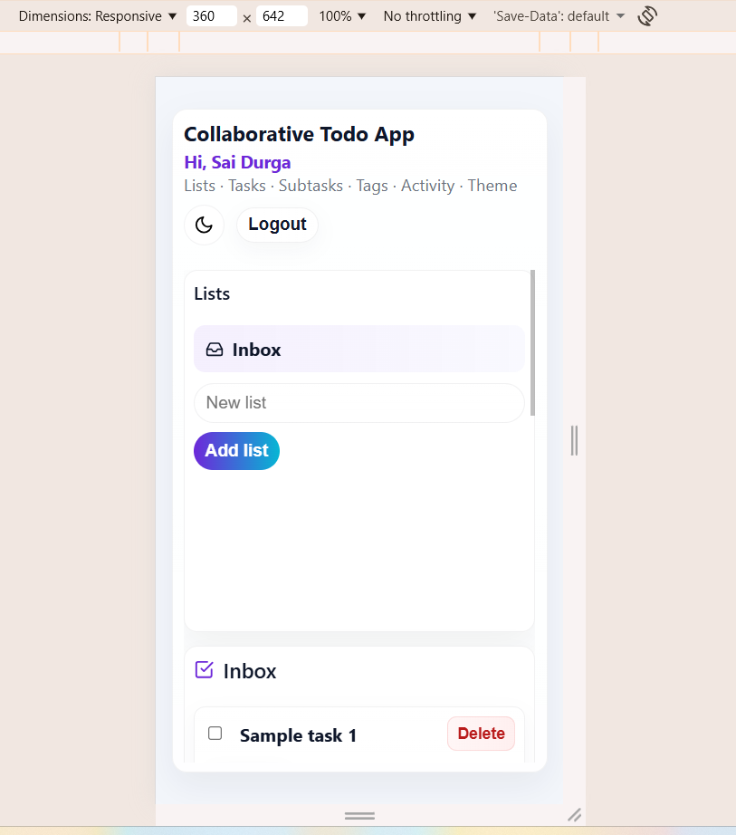

# 🌐 Collaborative Todo Application  

A feature-rich, responsive, collaborative Todo application built using **React** and **advanced Context API architecture**.  
This project demonstrates multi-context state management, performance optimization with memoization, custom hooks, simulated collaboration, and modern UI/UX.

---

## 🚀 Features

### 🔐 Authentication
- Mock login/logout using a simple username.
- App content is protected and only visible to authenticated users.

### 📝 Task Management
- Create, edit, complete, and delete tasks.
- Nested subtasks structure.
- Add and remove tags.
- Multiple lists (Inbox + custom lists).
- All operations update immediately.

### 🤝 Collaboration Simulation
- Activity feed logs all user actions.
- Simulates multi-user collaboration.

### 🎨 UI & User Preferences
- Light/Dark theme toggle.
- Fully responsive UI (Mobile, Tablet, Desktop).
- Clean, modern, minimalistic design.

### ⚡ Performance Optimizations
- `React.memo`
- `useCallback`, `useMemo`
- Split Context Architecture → AuthContext, TodosContext, UIContext, CollaborationContext

### 🧩 Custom Hooks
- `useAuth`, `useTodos`, `useUI`, `useCollaboration`

---

## 🏗 Tech Stack
- React (Vite)
- React Context API
- React Icons
- Custom Responsive CSS

---

## 📁 Project Architecture
src/
├── App.jsx
├── index.css
├── main.jsx
├── contexts/
│ ├── AuthContext.jsx
│ ├── TodosContext.jsx
│ ├── UIContext.jsx
│ ├── CollaborationContext.jsx


---

## 🌍 Live Demo

**Live URL:** https://<your-deployment-url>  
*(Replace with Netlify/Vercel URL)*

---

## 🖼️ Screenshot Previews

> Add these images inside `/screenshots/`

- `screenshots/desktop.png` — Desktop view  
- `screenshots/tablet.png` — Tablet view  
- `screenshots/mobile.png` — Mobile view

Desktop Preview  


Tablet Preview  


Mobile Preview  


---

## 🎥 Video Walkthrough (2–5 minutes)

**Video URL:** https://drive.google.com/file/d/1VTxMyw3D3x8BMS7RVPvWTmdppSqahLh_/view?usp=sharing

### What to show in the video
1. Login (enter name)
2. Create a new list
3. Add tasks
4. Add subtasks & tags
5. Mark task/subtask complete
6. Delete a task/list
7. Show activity feed
8. Toggle light/dark theme
9. Show responsiveness (desktop → tablet → mobile)

---

### ⚙️ Setup & Installation

Follow these steps to run the Collaborative Todo Application locally on your system.

**📥 1. Download or Clone the Repository**

You can get the project using Git:
```bash
   git clone https://github.com/SaiDurga-28/collaborative-todo.git
   cd collaborative-todo
```
**📦 2. Install Dependencies**

Install all required packages:

```bash
   npm install
```

This installs:

- React

- Vite

- React Icons

- All Context Providers

- Other dependencies

**🚀 3. Start the Development Server**

Run the app locally:

```bash
   npm run dev
```

Vite will start the server and display a URL like:

http://localhost:5173/


Open this link in your browser to view the application.